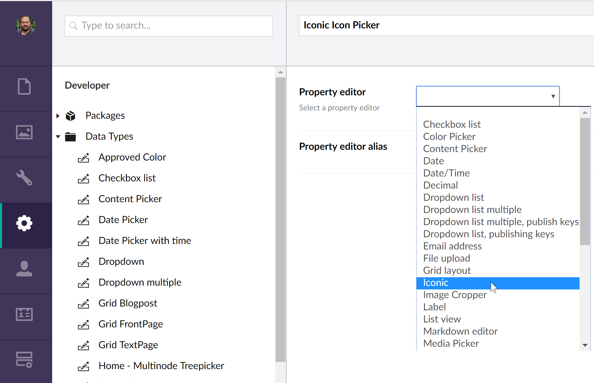
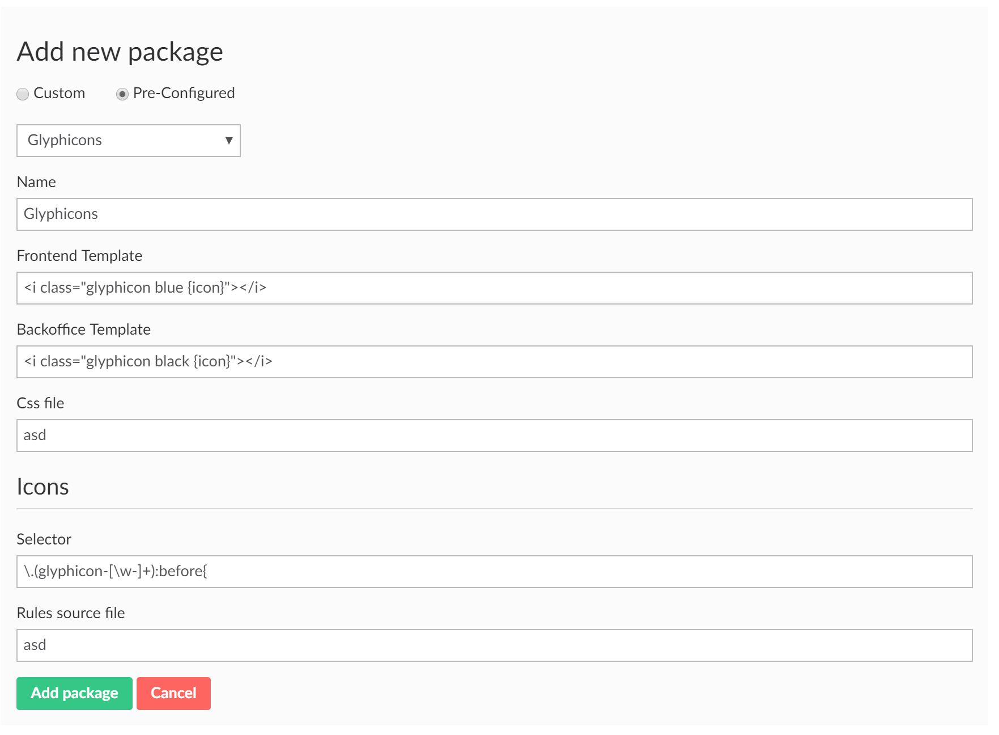
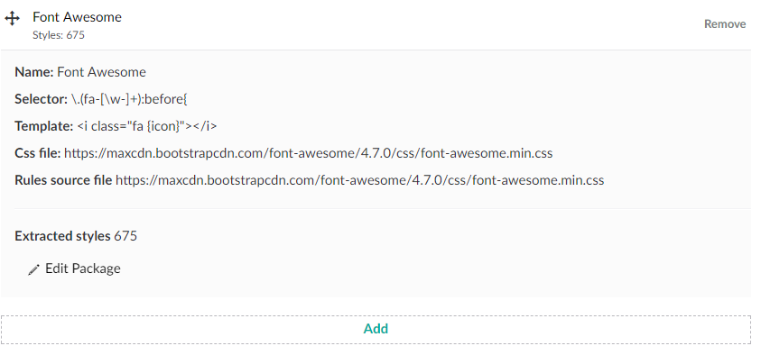
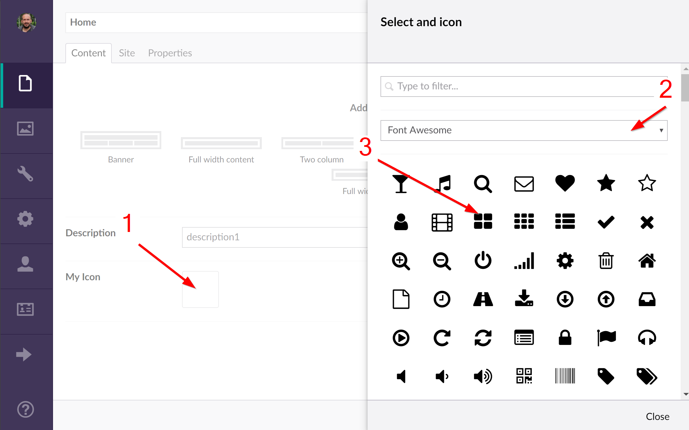

# Iconic
Highly configurable icon picker for Umbraco.

## Introduction
With Iconic you will be able to create a property editor that can use virtually any font package out there and not only that, you will  be able to select your icon from more than one package on the same property.

## Installation

### Nuget
[](https://www.nuget.org/packages/Koben.Iconic/)

You can run the following command from within Visual Studio:

    PM> Install-Package Koben.Iconic

### Umbraco Package
https://our.umbraco.com/packages/backoffice-extensions/iconic/


### Manually
Download the code and copy it into you App_Plugin folder.


## Configuration
Once the plugin is installed is time to configure it to your needs.

### Create a new DataType
You have to create a new datatype from the Iconic editor:
1. Go to the Developer section.
2. Right click on *DataTypes*, click *Create* and click on *New data type*.
3. Enter a name for your datatype and select Iconic from the *Property Editor* dropdown.



At this point I would recommend you to save your datatype as the configuration can take a bit of trial an error as you will need to deal with some regex and urls.

### Iconic Configuration
On the Packages Configuration property, click the Add button. This will display a new form that you will use to configure your new font package.
1. Enter the name for your package
2. Create your selector. This will use regex to extract your icons css from the font package.
3. Source file path. This file will contains the specific configuration for each icon.
   To extract the rules the previous regex rule will be used. This file will normally be a CSS file where the rules are contained. You can use absolute or relative paths. See below.
4. Path to your font package css file.
    * You can use absolute paths: http:\\www.yoursite.com\sytles\fonts\my-font-package.css. This allows you to use external files, like the ones from a CDN.
    * Or relative to the root: \styles\fonts\my-font-package.css
    This file will be loaded in the head of your backoffice and will affect the whole view so be careful of what you load there. Check the Known Issues section for some more info.

5. Template. This will be the template your icon will be based on. You can use the value ```{icon}``` as placeholder for your icon specific rule. For instance, for Font Awesome you should enter something like: `<i class="fa {icon}"></i>`
6. Override Backoffice template. Optional. You can override the Template value to use differente templates for frontend and backoffice.
6. Click *Add Package* to add the configuration to your packages listing. Before adding the package, Iconic will extract the css rules from the file using the regex selector. Some checking is ran that will let you know if something went wrong with your configuration.

#### Template Placeholders
You can use the following placeholders to customize the way your icon is rendered in the frontend:
- *\{icon\}* : Here is where the specific icon rule will be included. For instance, for a Font Awesome icon you would do ```<i class="fa {icon}"></i>```
- *\{classes\}*: You can add extra classes to your icon from your views. See [Displaying the Icon](#displaying)
- *\{attributes}*: You can use this placehoder to add extra attributes to your icon from your views. This can be useful to add data attributes for instance amongst other things. See [Displaying the Icon](#displaying)

#### Icons source file
This file will be used to extract the specific configuration for each different icon.

For example, some packages like Font Awesome use css rules to apply the specific icon:
```
<i class="fa fa-glass"></i> (Template: <i class="fa {icon}"></i>)
```

Other packages like Material Icons use the glyph codes or even ligatures to display the icon instead of a specific css selector. 
```
<i class="material-icons">alarm</i> (Template: <i class="material-icons">{icon}</i>)
```
So this file can be the same css file or another files used to extract the icons property. In the case of Material Icons for instance there is a file called <a href="iconfont/codepoints">codepoints</a> where you can extract the icons names from.

##### Material Icons
If you're having issues configuring Material Icons, try this configuration:

**Css File**: https://fonts.googleapis.com/icon?family=Material+Icons

**Rules file**: https://github.com/mattecapu/md-icons-codepoints

##### Font Awesome 5
The version 5 is a bit tricky to configure. There is a <a href="https://www.edg3.co.uk/blog/how-to-add-font-awesome-v5-icons-using-iconic-in-umbraco/">great post</a> about it, thanks to Christopher Robinson.


#### Pre configured packages
To make your life easier I have included some help to configure your packages in the form of pre-configured packages. If you select *Pre-Configured* when creating your package, you will have access to a list of pre-configured ones. You will still have to enter your css file path.



You can add as many packages you like. You can also arrange their order or remove those you don't want to use anymore.

*Note*: the regex included in the preconfigs are valid for the **minimised versions** of them.

#### Reviewing your configuration
Once you have added your configuration, this will be added to the configurations list. You add add as many as you want. To review the details of your configured package just click on them:



You will get a read-only list of your values. To edit them just click on the Edit Package option.

### Using the DataType
Once you have configured your datatype, you can use it as a property editor.


To add or modify your icon just click on the placeholder, this will open a dialog where you can select form your configured packages. Once a package is selected, all the icons will be displayed below.


### <a name="displaying"></a> Displaying the icon
Iconic comes with a value converter that will return a HtmlString containing the icon html. So you just have to use the model of your template like so:

```
@Html.Raw(Model.Content.MyIcon)
```

Remember to wrap the icon in Html.Raw so Razor displays the returned html properly.


There is a second way of rendering your icon that allow you to add extra classes and attributes from your views. Remember that you need to add the placeholders on the right place of your template when you confgiure Iconic.<br>
```IHtmlString RenderIcon(this HtmlHelper helper, IHtmlString icon, object htmlAttributes, params string[] extraClasses)```

**For this extension to work you'll have to include `@using Iconic.Helpers` on your view.**

Example:
    @Html.RenderIcon(Model.Content.MyIcon, "dataX='mydata'", "myclass")

If you had a template like `<i class="fa {icon} {classes} fa-5x" {attributes}></i>` This will render to:

     <i class="fa fa-power-off myclass fa-5x" data-x="mydata"></i>

Note that to render `data-x` you have to enter `dataX` as your attribute name.


## Known issues

### Stacked Content
If you are using stacked content and Iconic, you must ensure that any stacked document types do not use "icon" as the alias for an Icon Picker property editor. 
It's a known issue of Inner Content: <a href="https://github.com/umco/umbraco-inner-content#known-issues">https://github.com/umco/umbraco-inner-content#known-issues</a>

### Glyphicons
If you try to use Glyphicons as part of the Bootstrap package, you will realise that the whole css file will be loaded on your backoffice. This might break some of the backoffice functionality, i.e. buttons or the grid editor. To avoid this you should export the Glyphicons classes into their own separate file. You can do this from [this link](https://getbootstrap.com/docs/3.3/customize/) and select only Glyphicons from the **Components** section.

### Font Awesome Pro
Currently if you are using font awesome pro and stacked content, icons will not render correctly in stacked content preview

# Changelog
- 2.3.1 
    - Compatible with Umbraco 8.7
    - Support for virtual paths.
- 1.6
    - Unable to cast object of type 'Newtonsoft.Json.Linq.JObject' to type 'System.String'. FIXED
    - Added Pre-Configurations for Font Awesome 5.
- 1.5
    - Added support for extra attributes and classes
- 1.4
	- Added a feature to override Template to be able to use a different one in backoffice.
	- Fixed some missing languages labels.
	- Template of icons already in use is updated if it's modified on the package settings.

- 1.3
	- Support globalization. en and es included.
	- Supports IE11
	- Added Simple Line Icons preconfiguration
	- Returns empty string instead empty object if not configured
	- Little fixes
	
- 1.2.3
    - #7 Fixed compatibility with Nested Content.

- 1.2.1      
    - #4. When re-opening the Icon picker, the selected Icon should be highlighted
    - #5. If only one library is selected, the dropdown should default to this / default to first library
    - #6. Shows icon name on editor.
    
- 1.2
    - Added preconfig for Material Icons.
    - Existing packages can be edited.
    - Icon source file separate from css file.
    - Forms using better Angular validation.


---

Handmade by Mario Lopez - 2018 @KobenDigital
